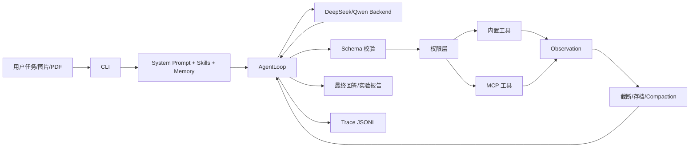

# mini-OpenClaw 科研智能体架构

## 设计目标

系统以单 Agent ReAct 主循环为稳定内核，通过 Planner、科研 Skills 和 Reviewer 式检查阶段完成角色分工。核心原则是正确、可复现、可追踪和安全。

## 关键取舍

- 使用显式 `task_list` 而不是隐藏思维链：计划可检查、可恢复、可演示。
- `edit` 采用唯一文本匹配：牺牲大规模重写速度，降低误改风险。
- 工具错误作为 observation：单步失败不拖垮任务，模型能根据结构化错误修复参数。
- 长工具结果保存到 `.mini-openclaw/observations/`，上下文只保留头尾与路径。
- Skills 是领域流程，Tools 是一次可执行动作；二者不混用。
- 外部网页、HTML 和 PDF 都是不可信数据，内容不能提升权限。
- 实验元数据、日志和报告绑定 Git、配置、随机种子和输出路径。

## 六层结构

1. 后端层：DeepSeek 文本、Qwen 视觉、FakeBackend 离线自检。
2. Agent 层：主循环、计划、上下文、记忆和权限。
3. 工具层：文件、Shell、搜索、PDF、实验、通知和任务清单。
4. 扩展层：MCP 与科研 Skills。
5. 安全层：工作目录边界、确认、危险命令和注入隔离。
6. 评测层：Trace、任务集、红队、真实消融与成本指标。

## 运行产物

- `.mini-openclaw/tasks.json`：长任务状态。
- `.mini-openclaw/observations/`：被截断的完整工具结果。
- `runs/<run-id>/`：实验元数据、日志和报告。
- `traces/*.jsonl`：模型与工具轨迹。
- `eval/results.csv`：真实任务评测结果。